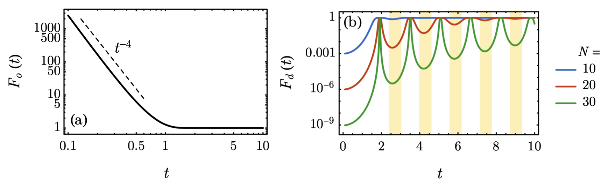

## Quantum state tomography for general people
**Quantum state tomography** is an essential **quantum technology** underlying the characterization of quantum devices and the discrimination of quantum states. It aims to reconstruct the density matrix from repeated measurements of identically prepared copies of a quantum system. Okay, what does those words mean? 

  

The quantum system is like the black box in the cartoon. It can be some quantum device/computer that we build, or it could be some weird quantum mechanical systems that Nature prepares for us. We, human, are curious creatures, so we would like to know what is inside this quantum black box. Usually, we would like to do is to open the box and see what is going on. However, this method fails here. And interestingly, the reason why it fails is fundamentally related to how Nature stores quantum information. And you will see while classical bits do not have privacy, quantum bits, aka qubits, do have **privary**. 

If you want to look into their private life, they will not yield! The weirdness of quantum life comes from two points: 
 1. The qubits can live a superposition life (entanglement) 
 2. You cannot look at every aspect of their life (uncertainty principle)

### Things can live a superposition life 

  

You may already heard there is a famous cat in physics history, called Schodinger's cat. This cat risks its life to demonstrate the quantum superposition. As you can see, the quantum bits, visualized as spin-up(1), and spin-down(0), can be in superposition. Loosely speaking, it can be simultaneously 0 and 1. If you think this is not weird, map spin-up(1) as a living cat, and spin-down(0) as a dead cat. Then, inside this quantum black box, the cat is living and dead at the same time. This is the actual quantum state of that cat, and that is what we want to see inside the black box!.

However, as we discussed, the quantum cat has its **privacy**. Any measurement to a quantum system is destructive. If you want to look inside the quantum black box, you need as least flash some light, then photon will hit those delicate quantum objects and it changes the system from its original state. In other words, once you make some measurement to see the cat inside the box, it will be either living or dead. It will not reveal its original quantum state to you! In analog, you can think if we want to use laser to measure some quantities of a living cell, the laser will create stress for the cell, and what you see will deviate from the original state of the cell. It is just quantum systems are more delicate, and measurements are more destructive.

### Things cannot be simultaneously measured

  

Things can have different aspects. For example, a cake can have color and shape. Like the cake, a quantum object can also have different aspects, for example, spin information in z direction or in x direction. The fundamental difference is that for a cake you can learn its color and shape simultaneously, while it is forbidden for quantum system if those two aspects do not commute (some mathematical definition of two observables that cannot be measured at the same time). For example, suppose we have a quantum cake in side a holy box, and its shape can be square or round, color can be red or blue. There is an honest elf that guard the quantum cake. We can ask the elf what is the color of the cake or what is the shape of the cake. But if we ask the elf what is the color **AND** the shape of the cake, the elf wouldn't tell you, instead this answer is fundamentally forbidden. 

You may think "Okay, if that is the case, I can ask for the shape and color sequentially, then I can get the full information!" Once again, you are tricked by the quantum magic. The following senario can happen: First, you ask for the color. The elf tells you it is red. Then you ask for the shape, and the elf tells you it's round. Before you leave, you want to check again for the answer. So you ask the elf what is the color once again. And the elf tells you it is **blue**! How could this happen? The elf are forbidden to lie! While this is the quantum magic, and it also has something to do with the superposition. I think this fairytale can give you some tastes of how weird the quantum world can be and how hard to fully understand what is inside the quantum black box.

### Complexity

  

Even though the quantum world is weird, scientists can design experiments to fully unveal the quantum black box and understand the cat is being living and dead simultaneously in the quantum box. But this is hard, because 
While the complexity of exact tomography of the full density matrix scales exponentially with the system size due to the curse of dimensionality, approximate tomography with polynomial complexity has been developed with assumptions of the underlying quantum state, including _matrix product state tomography_, _reduced density matrix tomography_, and _machine learning tomography_ (If we want to learn more about ML-based tomography using information complete POVM measurements, I have created a [repo](https://github.com/hongyehu/Machine_Learning_Quantum_State_Tomography) using PyTorch).

## Classical shadow tomography of quantum states

  

  

## Hamiltonian-driven shadow tomography of quantum state

  

  

  

### Quantum art for you

  

