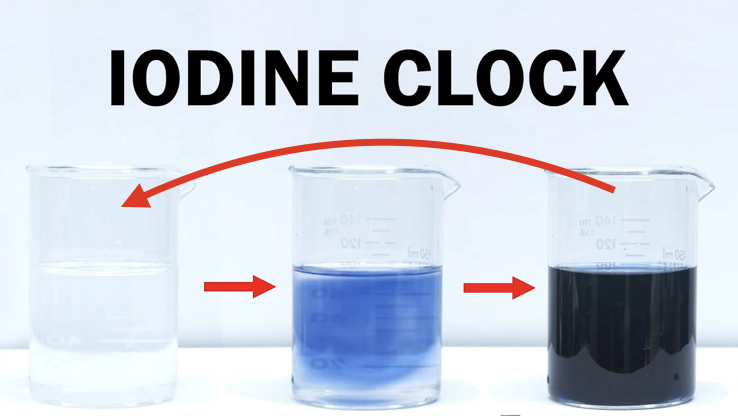

## Quantum state tomography for general people
**Quantum state tomography** is an essential **quantum technology** underlying the characterization of quantum devices and the discrimination of quantum states. It aims to reconstruct the density matrix from repeated measurements of identically prepared copies of a quantum system. Okay, what does those words mean? 

  

The quantum system is like the black box in the cartoon. It can be some quantum device/computer that we build, or it could be some weird quantum mechanical systems that Nature prepares for us. We, human, are curious creatures, so we would like to know what is inside this quantum black box. Usually, we would like to do is to open the box and see what is going on. However, this method fails here. And interestingly, the reason why it fails is fundamentally related to how Nature stores quantum information. And you will see while classical bits do not have privacy, quantum bits, aka qubits, do have **privacy**. 

If you want to look into their private life, they will not yield! The weirdness of quantum life comes from two points: 
 1. The qubits can live a superposition life
 2. You cannot look at every aspect of their life 

### Things can live a superposition life 

  

You may already heard there is a famous cat in physics history, called Schodinger's cat. This cat risks its life to demonstrate the quantum superposition. As you can see, the quantum bits, visualized as spin-up(1), and spin-down(0), can be in superposition. Loosely speaking, it can be simultaneously 0 and 1. If you think this is not weird, map spin-up(1) as a living cat, and spin-down(0) as a dead cat. Then, inside this quantum black box, the cat is living and dead at the same time. This is the actual quantum state of that cat, and that is what we want to see inside the black box!.

However, as we discussed, the quantum cat has its **privacy**. Any measurement to a quantum system is destructive. If you want to look inside the quantum black box, you need as least flash some light, then photon will hit those delicate quantum objects and it changes the system from its original state. That is one reason. And more fundamentally, the destructiveness of measurment is related to axioms of quantum mechanics and quantum system can be in superposition states*. In other words, once you make some measurements to see the cat inside the box, it will be either living or dead. It will not reveal its original quantum state to you! As an analogy (_maybe not a very good analogy, because living cells fundamentally cannot live a superposition life, unless it is entangled to a quantum system_), you can think if we want to use laser to measure some quantities of a living cell, the laser will create stress for the cell, and what you see will deviate from the original state of the cell. 
### Things cannot be simultaneously measured

  

Things can have different aspects. For example, a cake can have color and shape. Like the cake, a quantum object can also have different aspects, for example, spin information in z direction or in x direction. The fundamental difference is that for a cake you can learn its color and shape simultaneously, while it is forbidden for quantum system if those two aspects do not commute (some mathematical definition of two observables that cannot be measured at the same time). For example, suppose we have a quantum cake in side a holy box, and its shape can be square or round, color can be red or blue. There is an honest elf that guard the quantum cake. We can ask the elf what is the color of the cake or what is the shape of the cake. But if we ask the elf what is the color **AND** the shape of the cake, the elf wouldn't tell you, instead this answer is fundamentally forbidden. 

You may think "Okay, if that is the case, I can ask for the shape and color sequentially, then I can get the full information!" Once again, you are tricked by the quantum magic. The following senario can happen: First, you ask for the color. The elf tells you it is red. Then you ask for the shape, and the elf tells you it's round. Before you leave, you want to check again for the answer. So you ask the elf what is the color once again. And the elf tells you it is **blue**! How could this happen? The elf are forbidden to lie! While this is the quantum magic, and it also has something to do with the superposition. I think this fairytale can give you some tastes of how weird the quantum world can be and how hard to fully understand what is inside the quantum black box.

### Why should we care about quantum state tomography?
Even though the quantum world is weird, scientists can design experiments to fully unveal the quantum black box and understand the cat is being living and dead simultaneously in the quantum box. This procedure is called **Quantum state tomography** (QST). QST is very important. Scientifically, we would like to understand Nature prepared quantum systems. For example, quantum materials, such as superconductors, exhibit weird and beautiful behaviors. Once we understand those properties, we can utilize their properties to benefit the society. 

  

On the other hand, the scale that human can control and manipulate marks the level of our eigeneering ability. We would like to build and manipulate quantum information just like we build computer and manipulate classical information. In the era of classical computing, we store everything on string of bits, such as 0s and 1s, and we build classical machine to manipulate them, we code programs to do calculations, so that we can buy things online and saves us during the pandemic. If we can build quantum machine, such as quantum computer, it will operate on the string of quantum bits, like the second row of the cartoon. We want to read those quantum memories, so QST may help. If one day quantum machine can be build, and we can manipulate quantum information, that will be the new era.

### How hard is quantum state tomography?
In the previous, we have seen unveal the truth of a quantum system is non-trivial. In fact, it is really hard! Smart people proved that if we want to know every small aspects of a quantum system, aka full tomography, it is going to take exponentially many experiments as the system size grows. Loosely speaking, if we have two quantum bits, we need to do 4 experiments; 10 qbits need 1024 experiments; 100 qbits need 1267650600228229401496703205376 experiments! Compared to classical computer, 100 bits is nothing. 

But is it doomed? If you want to know every aspects of a quantum black box, which you know nothing beforehand, unfortunately the answer is yes. However, there is wiggle room:

 - First way: If we know some information about the quantum system, then we can make certain assumptions, and do approximate tomography with polynomial complexity. Along this way, there are _matrix product state tomography_, _reduced density matrix tomography_, and _machine learning tomography_ (If we want to learn more about ML-based tomography using information complete POVM measurements, I have created a [repo](https://github.com/hongyehu/Machine_Learning_Quantum_State_Tomography) using PyTorch).

The first way is good. But it introduces bias, since our assumption may not be right. Recently, there is another beautiful tomography idea called "**Shadow tomography**", which is the main focus of our research paper and the main content in the following sections.

 - Second way: The key idea of shadow tomography is that: in many tasks, we perform tomography because we want to predict behaviors of the quantum system. And in order to accurately predict its behavior, sometimes we do not need to know every aspects of the quantum system.

In the following, we will illustrate the idea of classical shadow tomography, and state our main results on **Hamiltonian-driven shadow tomography**.

## Classical shadow tomography of quantum states

  

To understand the idea of classical shadow tomography, let's look at a classical example. Suppose in the room, there is some object, which we would like to know the shape. We cannot touch it, but we can project light in the room and observe the shadow of the light. To estimate what is inside the room, one way is to project light from different angles, and collect the shapes of the shadow. From the collection of shadows, we can reconstruct what is inside the room. And importantly, the most efficient and unbiased way to choose the angle of light projection is choosing that randomly!

  

Shadow tomography[1] of the quantum states utilize the same idea. Only this time, we have a quantum object, which is described by density matrix, in the room. And to have an efficient estimation of that quantum state, we can choose random angle to do projective measurements in experiments! In doing so, we can collect many classical shadows of the underlying quantum state. And we can store and post-process those classical shadows on classical computers. The above figure shows some classical shadows of a quantum state.

  

Once we have the classical shadows, we can do some special linear combination of those classical shadows and unveal the underlying quantum state. For example, we showed after post-processing of classical shadows, we reconstruct the cat-state or GHZ state of the quantum system.

One reason people like shadow tomography is this scheme reaches the maximal efficiency bound[2]! In fact, if the physical quantity we care about is rank-1, such as quantum fidelity, then shadow tomography needs a constant number of experiments to achieve the same accuracy, no matter how large the system is! How amazing is this!

## Hamiltonian-driven shadow tomography of quantum state
In the previous section, we have seen the shadow tomography utilize random projection measurements to collect classical shadows of the quantum state, and the random projection is crucial. Because it grasp most information in an unbiased way. In experiments, one can implement global random Clifford gates to evolve the quantum state and do projection measurements on computational basis. Those two descriptions are equivalent. The global Clifford gate scrambles the information most efficiently so that computational basis measurements captures all the information. However, it may be hard to implement such a scheme practically. 

  

In our paper, we propose the possibility of using general chaotic Hamiltonian to evolve the system, and do projective measurements in computational basis, as the cartoon illustrated. In other words, those "light projection angles" are determined by random chaotic Hamiltonians. In our scheme, we think Hamiltonian-driven shadow tomography may be more practical to implement in the NISQ machine. Also this gives us the information dynamics of the system, and allows us to investigate scrambling of quantum informations in the tomography.

### Efficiency and scrambling beats
In our paper[3], we theoretically calculated the reconstruction channel, which can reconstruct the underlying quantum state from classical shadows. And we also theoretically investigated the tomography efficiency of our scheme. There are two limits, that is easy to understand. 

#### t -> 0 limit
In this limit, the quantum state does not evolve at all, and we take the projective measurement on computational basis, i.e. the Pauli-Z basis. In this case, we can easily reconstruct the diagonal information of underlying density matrix, since experiments directly measure the diagonal part information. As a matter of fact, the tomography efficiency has a factor of D speed up compared to shadow tomography in [2]. But off-diagonal information is completely lost.
#### t -> infinity limit
In this limit, the chaotic Hamiltonian fully scrambled the underlying quantum state, and this will be equivalent to the random Clifford shadow tomography[2], which has the optimal efficiency.
#### intermediate time window, and scrambling beats

  

The intermediate time is when interesting phenomenon happen. In the above picture, it roughly shows the tomography efficiency ratio of our scheme compared to random Clifford scheme[2]. The left figure shows the tomography efficiency of off-diagonal observables, and the right figure shows the tomography efficiency of diagonal observables.

For **off-diagonal observables**, it diverges as t approach zero, as it is impossible to infer the off-diagonal information from computational basis measurement in the absence of information scrambling. As time evolves, the off-diagonal information gets scrambled to the diagonal part, then F_o(t) decays with t as t^{-4}, as shown in the left figure. F_o(t) quickly approaches 1 after a characteristic time set by the inverse energy scale of the Hamiltonian H. Thus in the Hamiltonian-driven shadow tomography, one just needs to wait for the scrambling time to achieve effectively the same efficiency as random-unitary-based shadow tomography in terms of off-diagonal observable. Moreover, the scrambling time is independent of system size N.

For **diagonal observables**, F_d(t) is of the order F_d(t)~ D^{-1}=2^{-N} at t=0, which is exponentially small in system size N. Without any unitary scrambling, the computational basis measurement is directly measuring the diagonal information of the density matrix, therefore it requires much fewer samples to infer diagonal observables as compared to that of the general-purpose random-unitary-based shadow tomography. As time evolves, the diagonal information is scrambled away, hence more samples are required to achieve the accuracy goal. So the tomography efficiency decreases with time for diagonal observables, in contrast to the increasing efficiency for off-diagonal observables.

Interestingly, F_d(t) peaks to its maximal value periodically before it saturates to its long-time limit, as shown in the above figure(right). At these peaks, the diagonal information is maximally scrambled, therefore we name this phenomenon as **scrambling beats**. Under coherent Hamiltonian evolution, the scrambled information can partially bounce back in a finite-size system, leading to the beat behavior of F_d(t). This is really similar to the chemical "clock" phenomenon, here is a [video](https://www.youtube.com/watch?v=WpBwlSn1XPQ). But how long scrambling beats will last depends on the system size. The characteristic time for scrambling beats to die off is of the order t_d~ D^{1/6}=2^{N/6}. Before this time scale, there exist time windows between peaks, as yellow-shaded regions in the above figure, when the sample form factor maintains at a low level of F_d(t)~ D^{-1}.

  

### Summary
In summary, we propose to use Hamiltonian generated unitary evolution to scramble the quantum information for shadow tomography. We investigated the efficiency of the Hamiltonian-driven shadow tomography and showed that it can be superior to the shadow tomography based on 2-design random unitaries within an intermediate time window. Although our analysis is based on the GUE random Hamiltonian, we expect that the result could be generalized to other types of quantum chaotic Hamiltonians.

### Other resources
If you like the idea of classical shadow tomography, I also encourage you to watch Hsin-Yuan Huang's talk at IQIM [link](https://www.youtube.com/watch?v=xRHXsPp1O0I&feature=youtu.be) and QIP2021 [link](https://www.youtube.com/watch?v=d1_hBEJQUSA&feature=share)

### Acknowledgement 
The author thanks insightful discussions with Robert Hsin-Yuan Huang, and Junyu Liu.

\* The author thanks Prof. Biao Wu from Peking University for the insightful discussions and suggestions.

### References
[1]Scott Aaronson. [arXiv:1711.01053](https://arxiv.org/abs/1711.01053). Shadow tomography of quantum states.

[2]Hsin-Yuan Huang, Richard Kueng & John Preskill. [Nature Physics volume 16, pages1050–1057(2020)](https://www.nature.com/articles/s41567-020-0932-7). _Predicting many properties of a quantum system from very few measurements_

[3]Hong-Ye Hu, Yi-Zhuang You. [arXiv:2102.10132](https://arxiv.org/pdf/2102.10132.pdf). _Hamiltonian-driven shadow tomography of quantum states_.

