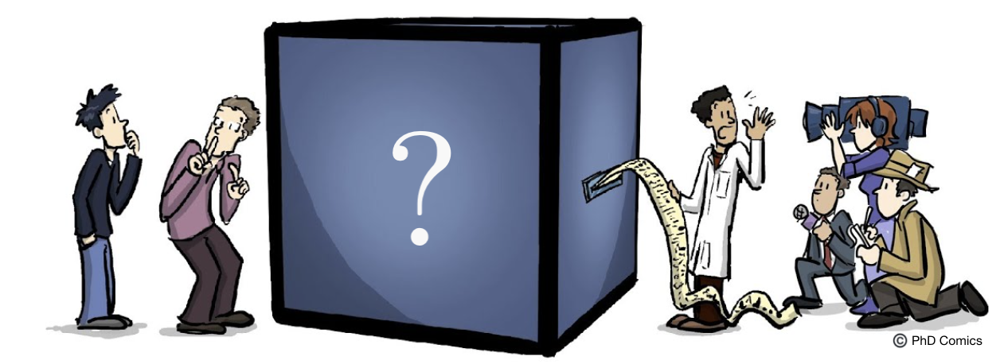

## Quantum state tomography for general people
**Quantum state tomography** is an essential **quantum technology** underlying the characterization of quantum devices and the discrimination of quantum states. It aims to reconstruct the density matrix from repeated measurements of identically prepared copies of a quantum system. Okay, what does those words mean?

  

The above cartoon nicely illustrated what I want to say.

  

While the complexity of exact tomography of the full density matrix scales exponentially with the system size due to the curse of dimensionality, approximate tomography with polynomial complexity has been developed with assumptions of the underlying quantum state, including _matrix product state tomography_, _reduced density matrix tomography_, and _machine learning tomography_ (If we want to learn more about ML-based tomography using information complete POVM measurements, I have created a [repo](https://github.com/hongyehu/Machine_Learning_Quantum_State_Tomography) using PyTorch).

## Classical shadow tomography of quantum states

  

  

## Hamiltonian-driven shadow tomography of quantum state

  

  

  

### Quantum art for you

  

